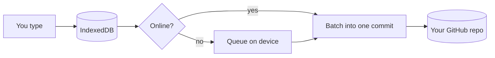

# Architecture

How a keystroke becomes a commit.

```mermaid
flowchart LR
    A[You type]
    B[(IndexedDB)]
    C{Online?}
    D[Batch into one commit]
    E[Queue on device]
    F[(Your GitHub repo)]
    A --> B
    B --> C
    C -- yes --> D
    C -- no --> E
    E --> D
    D --> F
    %% forkleaf:layout A:80,60;B:300,60;C:520,60;D:80,190;E:300,190;F:584,344
```

See [[deploy-runbook]] for how it ships.